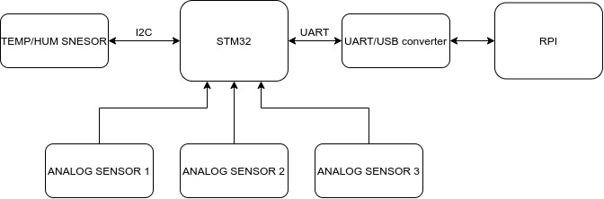
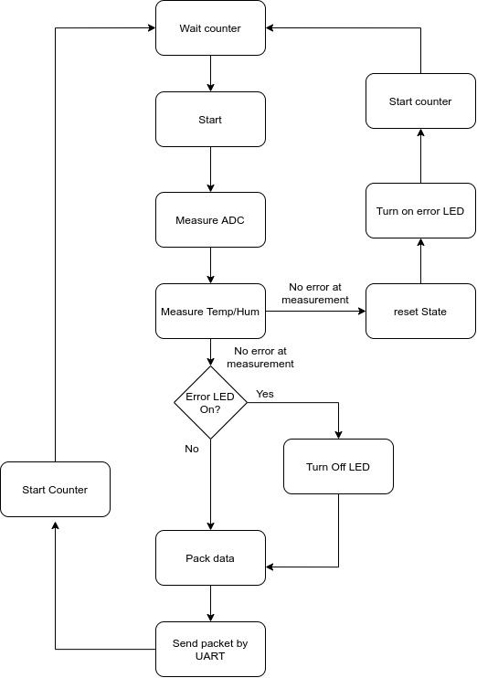

# SmartGarden

Smart garden is an embbeded system made with an educational intention.  
 
The main brain is the STM32F303RE microcontroller, this is a 32 bit cortex M4 microcontroller and is connected via serial UART communication with a raspberry pi that will store the data and will host the web app in order to visualize data 

The hardware architecture is shown in the following figure: 
 

## STM32F302RE

STM32F302x8 is a 32 bit Cortex-M4 microcontroller. This project uses the following peripherals:
- ADC
- I2C
- UART
- DMA

For more information about the microcontroller, you can download de datasheet from [STM Website](https://www.st.com/en/microcontrollers-microprocessors/stm32f302c8.html).

### Firmware
The firmware is made using the CMSIS standard except the I2C driver, it uses STM HAL library. The flow chart can be seen in the following picture:  
 

## Raspberry pi

